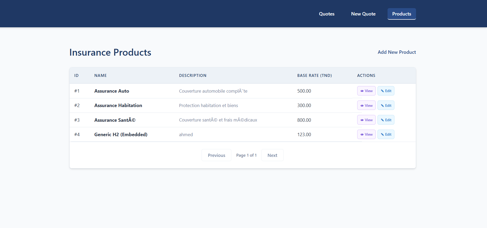
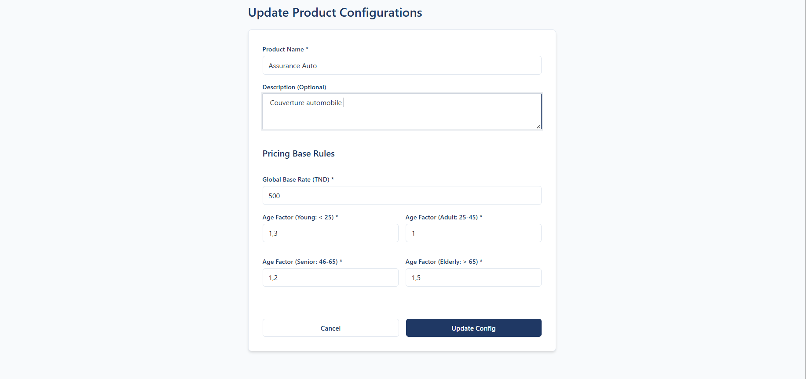
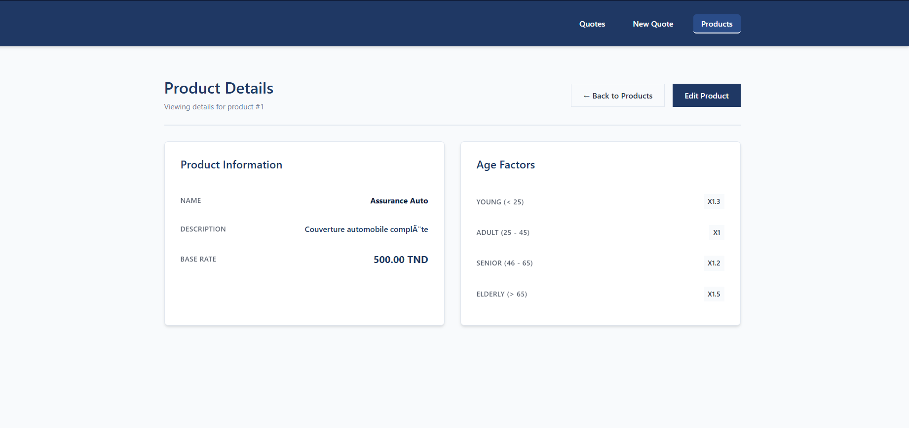
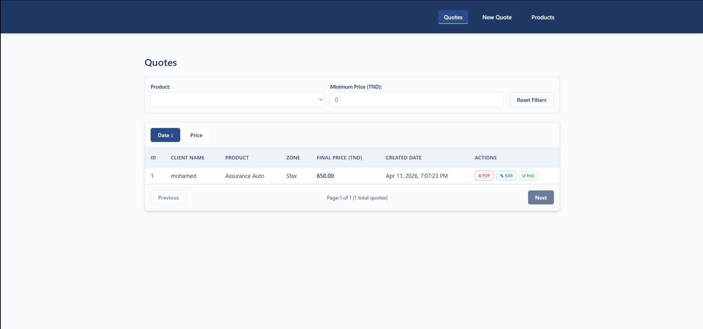
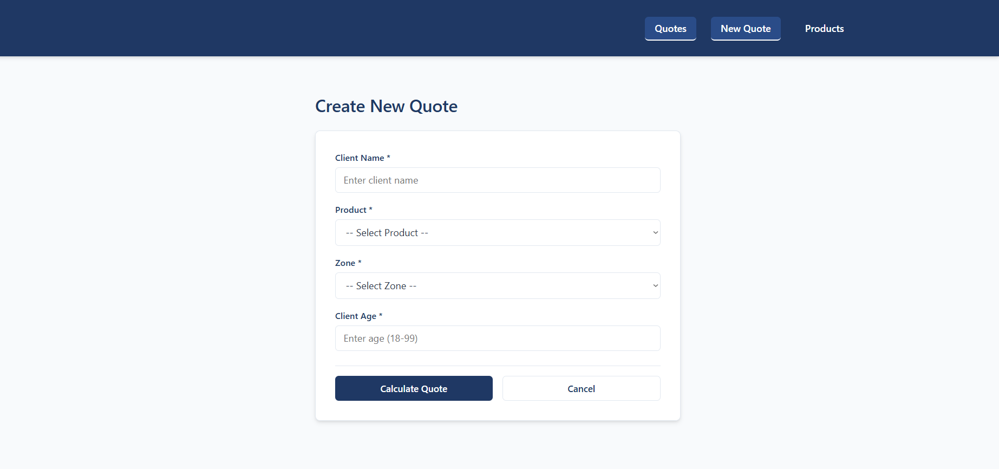
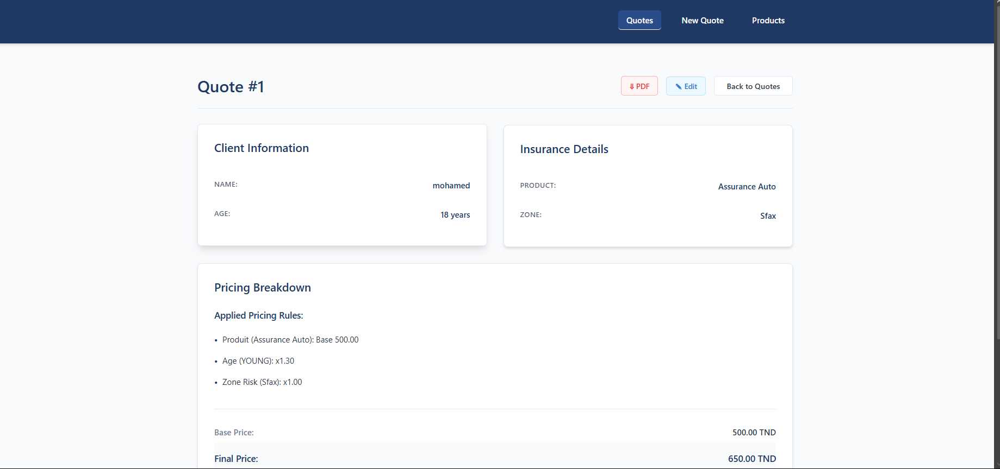

# Tendanz Pricing Engine
A full-stack enterprise application for managing dynamic insurance pricing rules, calculating personalized quotes, and generating PDF documents.

## Table of Contents

- [Project Overview](#project-overview)
- [Repository Structure](#repository-structure)
- [Getting Started](#getting-started)
- [Screenshots](#-screenshots)
- [Architecture Overview](#architecture-overview)
- [API Overview](#api-overview)

## Project Overview
This project solves the challenge of dynamic insurance pricing. It provides administrators with a robust system to create/edit insurance products and their associated demographic pricing factors. It empowers agents to generate real-time quotes for clients based on age, selected product, and geographic zone.

**Tech Stack Summary:**
- **Backend:** Java 17+, Spring Boot 3, Spring Data JPA, H2 Database (in-memory)
- **Frontend:** Angular 17 (Standalone Components), TypeScript, RxJS, HTML5/CSS3
- **Tooling:** Maven, npm, Angular CLI

## Repository Structure

test-technique-fullstack/
 backend/            # Spring Boot REST API providing pricing logic and data persistence
 frontend/           # Angular 17 SPA providing the user administration interface
 README.md           # Global project documentation
 ...
\
## Getting Started
### Prerequisites
- Java 17 or higher
- Node.js (v18+)
- Maven 3.8+
- Angular CLI

### Running the Full Stack

To start the entire application, you will need to open two separate terminal windows from the root of the project (`test-technique-fullstack/`).

**Terminal 1 (Backend - Spring Boot):**
```bash
cd backend
mvn clean install
mvn spring-boot:run
```
*The backend API will start on http://localhost:8080*

**Terminal 2 (Frontend - Angular):**
```bash
cd frontend
npm install
ng serve
```
*The frontend app will be accessible at http://localhost:4200*

## 📸 Screenshots

Here is a glimpse of the application's frontend interfaces:

### Products Management
**Product List**  


**Create Product**  


**Product Details**  


### Quotes Management
**Quote List**  


**Create Quote**  


**Quote Details**  


## Architecture Overview
The system follows a standard Client-Server architecture. The Angular frontend communicates with the Spring Boot backend via a RESTful API using JSON payloads.
- **Frontend:** Handles client validation, data formatting, and routing.
- **Backend:** Evaluates pricing logic, stores products/rules/quotes, and generates PDF byte streams.
- **Database:** H2 relational database populated dynamically via schema.sql and data.sql.

## API Overview
- /api/quotes: Calculate quotes, retrieve history, generate PDFs.
- /api/products: Manage insurance products and complex demographic pricing factors.

Please see the [Backend README](./backend/README.md) and [Frontend README](./frontend/README.md) for deeper technical references.
